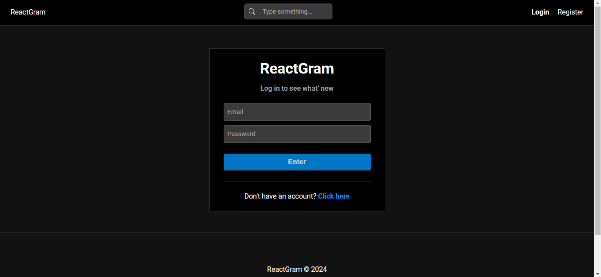

<h1 align='center'>ReactGram</h1>

<p align="center">
  <a href="#-sobre">Sobre</a>&nbsp;&nbsp;&nbsp;|&nbsp;&nbsp;&nbsp;
  <a href="#-layout">Layout</a>&nbsp;&nbsp;&nbsp;|&nbsp;&nbsp;&nbsp;
  <a href="#-funcionalidades">Funcionalidades</a>&nbsp;&nbsp;&nbsp;|&nbsp;&nbsp;&nbsp;
  <a href="#-tecnologias-e-ferramentas">Tecnologias e Ferramentas</a>&nbsp;&nbsp;&nbsp;|&nbsp;&nbsp;&nbsp;
  <a href="#-como-usar">Como usar</a>&nbsp;&nbsp;&nbsp;|&nbsp;&nbsp;&nbsp;
  <a href="#-licença">Licença</a>&nbsp;&nbsp;&nbsp;|&nbsp;&nbsp;&nbsp;
</p>

<p align="center">
    ✔ Projeto concluído
</p>

<hr/>


## ❓ Sobre

Este projeto é uma aplicação web fullstack que simula algumas das principais funcionalidades de uma rede social. 

Projeto baseado no curso de Node.js da empresa ['Hora de Codar'](https://horadecodar.com.br/). 

Clique [aqui](https://reactgram-4yia.onrender.com/) para conferir como ficou a aplicação hospedada na plataforma [Render](https://render.com/).  


## 🎨 Layout




## ⚙️ Funcionalidades

- [x] Cadastro de usuários
- [x] Autenticação de usuários
- [x] Gerenciamento de perfil de usuários
- [x] Gerenciamentos de fotos de usuários
- [x] Upload de imagens
- [x] Like em fotos
- [x] Comentário em fotos


## 🛠 Tecnologias e Ferramentas

- [ReactJS](https://react.dev/)
- [React Icons](https://www.npmjs.com/package/react-icons)
- [React Router](https://reactrouter.com/)
- [React Redux](https://www.npmjs.com/package/react-redux)
- [Redux Toolkit](https://www.npmjs.com/package/@reduxjs/toolkit)
- [Vite](https://vitejs.dev/)
- [Visual Studio Code](https://code.visualstudio.com/)
- [Events](https://www.npmjs.com/package/events)
- [BcryptJS](https://www.npmjs.com/package/bcryptjs)
- [Cors](https://www.npmjs.com/package/cors)
- [JWT](https://www.npmjs.com/package/jsonwebtoken)
- [MongoDB](https://www.npmjs.com/package/mongodb)
- [Mongoose](https://mongoosejs.com/)
- [MongoDB Atlas](https://www.mongodb.com/pt-br/atlas/database)
- [Multer](https://www.npmjs.com/package/multer)


Confira melhor as dependências do projeto:  

- [Front-End](./client/package.json)
- [Back-End](./package.json)


## 💻 Como usar

Antes de continuar, é recomendado possuir alguns conhecimentos básicos de [HTML5](https://developer.mozilla.org/pt-BR/docs/Web/HTML), [CSS3](https://developer.mozilla.org/pt-BR/docs/Web/HTML), [JavaScript](https://www.javascript.com/), [Node.js](https://nodejs.org/docs/latest/api/) e [ReactJS](https://react.dev/) para entender os códigos do projeto. 
Além disso, você precisa ter instalado em sua máquina o [GIT](https://git-scm.com/), [Node](https://nodejs.org/en) e um **editor de texto** de sua preferência. Recomendo sempre utilizar o [Visual Studio Code](https://code.visualstudio.com/). 

Um guia básico sobre como instalar e executar o projeto em modo de desenvolvimento na sua máquina local: 

1. Clone o projeto ou faça download do ZIP: 

```bash
    # abra o terminal (Git bash) e digite 
    # não precisa fazer isso se já tiver feito download do projeto (nesse caso, só extraia a pasta e entre nela)
    $ git clone https://github.com/Gustavo-Victor/get-a-pet.git
```

2. Entre na pasta do projeto:

```bash
    $ cd reactgram/
```

3. Instalar as dependências e executar o Back-End:

```bash
    $ npm install && npm run server 
```

4. Instalar as dependências do Front-End: 
    - Abra outra aba do terminal
    - Entre na pasta do Front-End, instale todas as dependências e execute a aplicação

```bash
    $ cd ./client && npm install && npm run client 
```

5. Abra o projeto no seu navegador de preferência:
    - Digite no seu navegador o URL: http://localhost:5173/

<hr/>


## 📝 Licença 

O projeto está sob a Licensa MIT 

Qualquer pessoa pode usar, clonar e contribuir com este projeto. 

Clique [aqui](./LICENSE) para saber mais  


